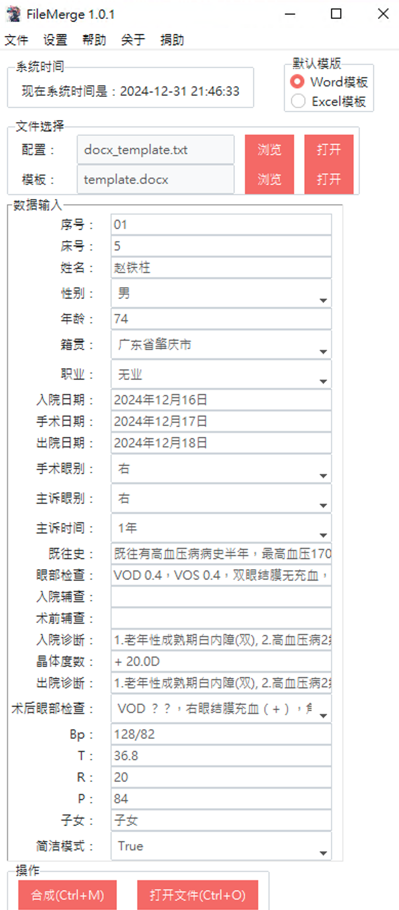
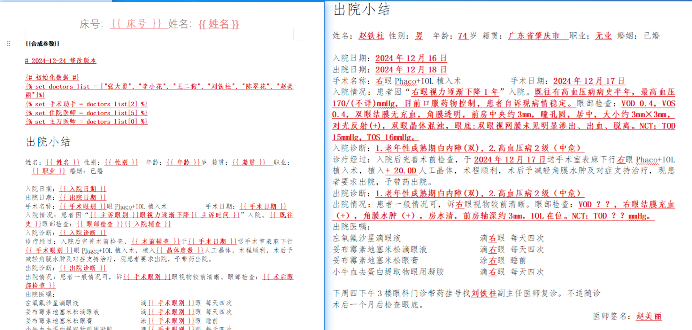

# FileMerge 📄

> 一个强大的 Word 和 Excel 文档模板合成工具 🛠️

[](https://www.python.org/downloads/)[](https://github.com/Awelling2/FileMerge/stargazers)

## 💡 演示





## 💡 简介

作为一名前眼科医生，我深知医疗工作者面临的文书工作压力。从最初使用 Excel 批量处理病历，到通过自学 Python 和靠不停的问 AI 而完成的这个项目，FileMerge 诞生于解决实际临床工作中的效率需求。

## 🔧 系统要求

- Python 3.8 或更高版本

## 📥 安装

### 从源码安装

```bash
# 克隆仓库
git clone https://github.com/Awelling2/FileMerge.git

# 进入项目目录
cd FileMerge

# 安装依赖
pip install -r requirements.txt

# 运行
python run.py
```

## ✨ 核心特性

### 🔄 智能文档合成

- 支持 Word 和 Excel 模板文件合成
- 灵活的自定义配置（txt 格式）：
  - 字符串类型自动生成输入框
  - 列表类型自动生成下拉选择框
  - 支持嵌套字典实现复杂配置
- 强大的 jinja2 模板语法支持：
  - 支持条件判断（if-else）
  - 支持循环语句（for）
  - 支持变量过滤器
  - 支持宏定义和模板继承

### 📂 自动化管理

- Word 文档按入院日期智能分类存储
- Excel 文件按申请日期智能归档
- 高度可配置的文件命名和目录结构

### 🖥️ 人性化界面

- 简洁直观的数据录入面板
- 便捷的快捷键操作体验（Command/Ctrl + M：合成，Command/Ctrl + O：打开）
- 清爽的默认主题设计

## 📌 项目结构

```
FileMerge/
├── documents/                # 文档资源
│   ├── template_docx/       # Word 模板
│   ├── template_excel/      # Excel 模板
│   ├── txt/                 # 配置文件
│   └── file_merge/          # 输出文件
│       ├── docx/            # Word 输出
│       └── xlsx/            # Excel 输出
├── src/                     # 源代码
└── config/                  # 配置文件
```

## 📝 配置文件说明

### txt 配置文件示例

```python
{
    "序号": "01",              # 字符串类型自动生成输入框
    "床号": "5",
    "姓名": "赵铁柱",
    "性别": ["男", "女"],      # 列表类型自动生成下拉选择框
    "年龄": "74",
    "籍贯": [                  # 下拉选择框支持多个选项
        "广东省肇庆市",
        "广东省云浮市",
        "广东省清远市",
        "广东省佛山市"
    ],
    "职业": [
        "无业","退休","农民",
        "学生","职工","儿童","幼儿"
    ],
    "手术眼别": ["右","左", "双"],
    "主诉眼别": ["右","左","双"],
    "主诉时间": ["1年","半年","1月"],
  
    # 长文本也使用输入框
    "既往史": "既往有高血压病病史半年，最高血压170/(不详)mmHg，目前口服药物控制，患者自诉现病情稳定。",
    "眼部检查": "VOD 0.4，VOS 0.4，双眼结膜无充血...",
  
    # 特殊功能开关也可以用下拉框
    "简洁模式": ["True","False"]
}
```

## ⚙️ 配置详解

### 📝 Word 文档配置

- 目录格式：按入院日期自动组织（例：2024年11月11日）
- 文件名：支持序号、姓名、手术眼别等字段灵活组合
- 由于每家医院的病例模版都不一致，这里我只释出了出院小结，你可以深度定制

### 📊 Excel 文档配置

- 目录格式：按申请日期智能分类（例：2024年11月）
- 文件名：支持日期、姓名、诊断等字段自由组合

## ⚠️ 注意事项

- 当前版本暂时禁用主题切换功能
- 推荐使用默认主题以获得最佳体验
- 首次使用请确保已正确配置模板文件

## 📋 版本信息

- 版本号：`1.0.2`
- 最新更新内容：

  - ✨ 下拉选框功能优化：

    - 新增选项值实时同步到模版功能
    - 支持手动输入新选项并自动保存
    - 优化下拉框选项的排序逻辑

## 📝 开源协议

本项目采用 GNU General Public License v3.0 (GPL-3.0) 协议开源，详见 [LICENSE](LICENSE) 文件。这意味着：

- ✅ 您可以自由使用、修改和分发本软件
- ✅ 如果您分发修改后的版本，必须开源并使用相同协议
- ✅ 必须保留原作者版权信息
- ✅ 对代码的任何修改都必须说明

## 🙏 致谢

- [python-docx](https://github.com/python-openxml/python-docx)
- [jinja2](https://github.com/pallets/jinja)

## 📊 项目状态


## ❤️ 支持项目

如果这个项目对您有帮助，欢迎扫码支持，这将鼓励我继续维护和改进这个项目！


